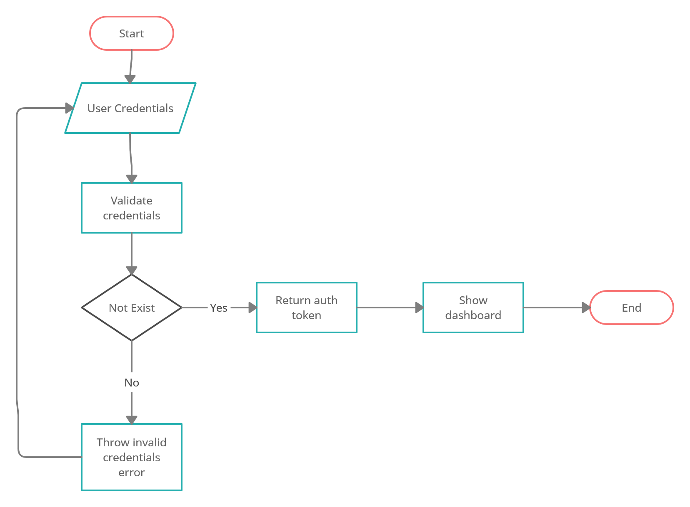

# PP-94 - Sign In

## Requisito

- "Yo como usuario quiero iniciar sesión para acceder a la plataforma".

## Acceptance criteria

- Permitir login con una cuenta existente
- 
    Mostrar mensaje de error onInvalidCredentials → redirect to dashboard page

## Diagramas de diseño

<table>
  <theader >
    <th >Diagrama de flujo</th>
      <th style="text-align:center">Artefactos de diseño</th>
  </theader>

  <tbody align="center">
    <tr >
      <td >Diagrama de flujo</td>
      <td>
        <ul>
          
        </ul>
      </td>
    </tr>
    <tr>
      <td>Casos de prueba</td>
      <td>
        <ul>
          <a href="https://docs.google.com/spreadsheets/d/16ehQSnRzp1Ajum9x7SWQOgrrmd7syu8VT2m2APsHofw/edit#gid=0">Hoja de spreadsheets con los casos de prueba.</a>
        </ul>
      </td>
    </tr>
  </tbody>
</table>

## Artefactos generados

- <a href="https://github.com/Taro-IT/frappe/pull/23">Pull request</a>

## Autores

- Alonso Vladimir Salvador Camacho
- Raúl Rosario Galaviz

## Auditoría
-
  

## Versión

- 1.0