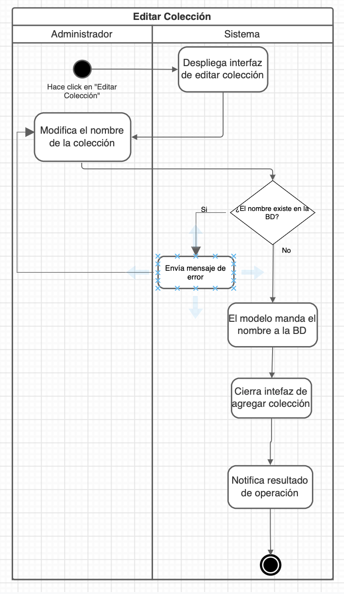

# PP-HA-302 Borrar categoría

## Requisito

- "Yo como administrador quiero eliminar una colección para reducir las categorías del catálogo".

## Acceptance criteria

**Dada** una categoría existente
**Cuando** se confirme su eliminación
**Entonces** los productos que la tengan pasarán a la categoría “Otras” y el nombre de la categoría quedará libre para volverse a usar.

## Diagramas de diseño

| Tipo de diagrama | Artefactos |
| ------------------|--------------------- |
| Diagrama de actividad |  |
| Wireframes | [PP-WF302.](https://www.figma.com/file/MiuSV67DUVkzMeMKJeAhP0/Untitled?node-id=0%3A1) |
| Diseño de pruebas |[PP-TS302](https://taro-depto-ti.atlassian.net/wiki/spaces/FC/pages/589845/FRAPPE-302+Yo+como+administrador+quiero+eliminar+una+colecci+n+para+reducir+las+categor+as+del+cat+logo#Dise%C3%B1o-de-pruebas-backend)|

## Artefactos generados

- <a href="https://github.com/Taro-IT/frappe/pull/25">Pull request</a>

## Autores

- Karla Daniela Romero Pérez
- Ivan Alejandro Díaz Peralta

## Auditoría
-

## Versión

- 1.0 - Creación del documento
