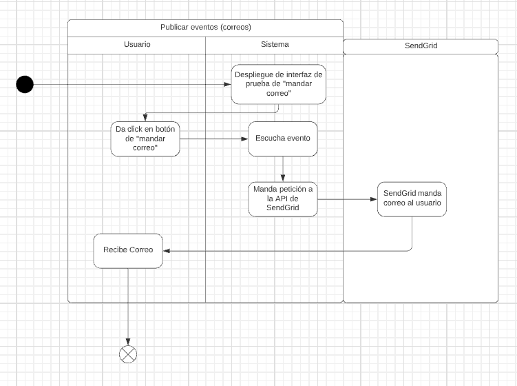

# PP-HA97 - Publish events (emails)

## Requisito

- Yo como usuario del sistema quiero recibir un correo cada vez que se publique un evento.

## Acceptance criteria

Dado una acción en el sistema que mande notificaciones,

Cuando se publique el evento,

Entonces los usuarios relevantes recibirán un correo.

## Diagramas

| Diagrama | Artefactos |
| ---------------------|------------------------ |
| [Diagrama de actividad](https://lucid.app/lucidchart/5e95085f-6356-4a1f-b9b9-bcf0c4aeb9ad/edit?viewport_loc=-454%2C146%2C2274%2C1084%2C98TTJ~8Bs_WK&invitationId=inv_0445573f-2ae8-4eb3-a484-055f1aff7687) |  |

## Architecture Spike
 - Se va usar SendGrid para mandar los correos.

Documentación consultada:

-  [How to set up domain authentication](https://docs.sendgrid.com/ui/account-and-settings/how-to-set-up-domain-authentication)
-  [DKIM Records Explained](https://docs.sendgrid.com/ui/account-and-settings/dkim-records)
-  [SendGrid](https://app.sendgrid.com/guide/integrate/langs/nodejs) (Falta cuenta de equipo para poder acceder a esta liga. Por el momento se puede consultar con la cuenta de Eduardo)
-  [SendGrid Templates with Parameters (Dynamic Template Data) and Send Email using Python Libraries](https://code.luasoftware.com/tutorials/sendgrid/python-sendgrid-with-parameters/)

## Artefactos generados

- [Pull Request](https://github.com/Taro-IT/frappe/pull/34)

## Autores

- Eric Buitrón López
- Eduardo Andrés Castillo Perera

## Auditoría
-

## Versión

- 1.0
