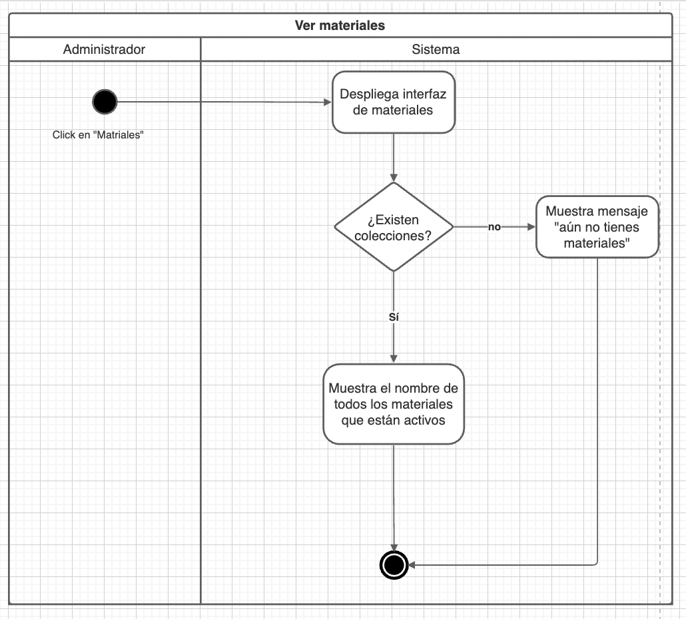
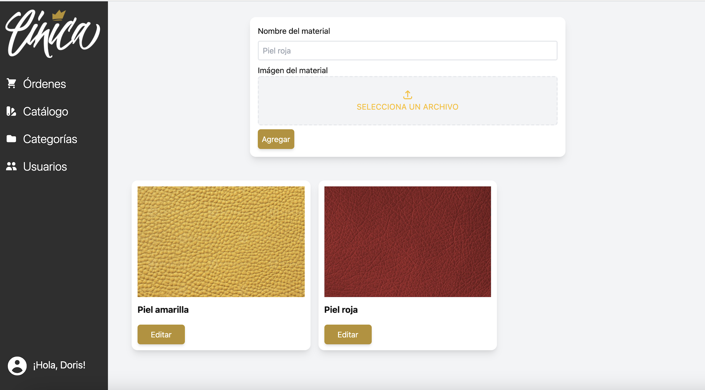

# PP-HA68 - List materials

## Requisito

- Yo como administrador quiero ver las opciones de customización disponibles para tener una idea de lo que le ofrezco a mis clientes.


## Acceptance criteria

_Dado un usuario_

_Cuando el usuario ingrese a la pantalla de materiales_

_Entonces mostrar los materiales disponibles._


## Diagramas

| Diagrama | Artefactos |
| ---------------------|------------------------ |
|Diagrama de actividad| |
|Wireframe||

## Documentación API

### GET List Materials
  `http://localhost:3000/api/material/`

  **Outputs**

  _Default:_ Un arreglo con objetos que representan los materiales

  ```json
    {
    "result": [
        {
            "id": "d2e3ded7-5b4e-4743-9dc1-e71c079be0f4",
            "name": "Cuero rojo",
            "image": "https://cinicastaticfiles.blob.core.windows.net/uploads/55d40f61-b485-4d12-9862-e56c7b6d3f36.jpeg",
            "isActive": true
        },
        {
            "id": "f026636c-a8da-4837-93fb-60982e678fed",
            "name": "Piel amarilla",
            "image": "https://cinicastaticfiles.blob.core.windows.net/uploads/979dddb0-b081-4829-8cfd-0d1e1dd8a9d4.jpeg",
            "isActive": true
        }
      ]
    }
    
  ```


## Artefactos generados

- [Pull Request](https://github.com/Taro-IT/frappe/pull/53/)


## Autores

- Karla Daniela Romero Pérez

## Auditoría
- Jan Limpens Gutierrez

## Versión

- 1.0 - Creación del documento
- 1.1 - Agregar imágenes a los artefactos generados