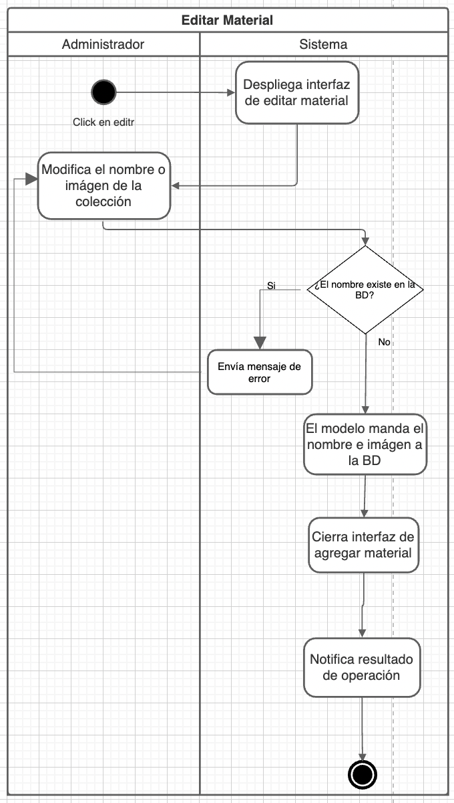
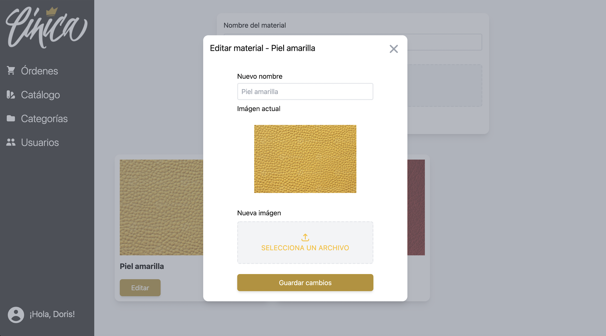

# PP-HA67 - Update material

## Requisito

- Yo como administrador quiero editar un material para tener siempre los materiales correctos en oferta.

## Acceptance criteria

_Dado un material existente_

_Cuando cambie su nombre o su imágen_

_Entonces los productos que la tengan también se verán editados, nunca vacíos ni repetidos._


## Diagramas

| Diagrama | Artefactos |
| ---------------------|------------------------ |
|Diagrama de actividad| |
|Wireframe| |

## Documentación API

### PATCH Update Material
  `http://localhost:3000/api/material/:id`


  **Inputs**

  Recibe un id como param, además de un nombre y un link a una imágen válida

  **Params**

  |Llave|Valor|Ejemplo|Descripción|
  |----|------|----|----|
  |Id| UUID | 37ff754d-66d8-40f5-b4fc-a72d2331213c |Id del material que se va a actualizar|

  **Body**


  ```json
    {
      "name": "Updated Test 1",
      "image": "https://cinicastaticfiles.blob.core.windows.net/uploads/37ff754d-66d8-40f5-b4fc-a72d2331562c.jpeg"
    }
    
  ```
    


  **Outputs**

  _Default:_ id del material actualizado.

  _MaterialAlreadyExists:_ Ya existe un material con ese nombre

  _MaterialNotFound:_ No existe un material con el identificador especificado.

## Artefactos generados

- [Pull Request](https://github.com/Taro-IT/frappe/pull/53/)


## Autores

- Karla Daniela Romero Pérez

## Auditoría
- Mauricio Álvarez Milán

## Versión

- 1.0 - Creación del documento
- 1.1 - Usar imágenes para los artefactos generados
