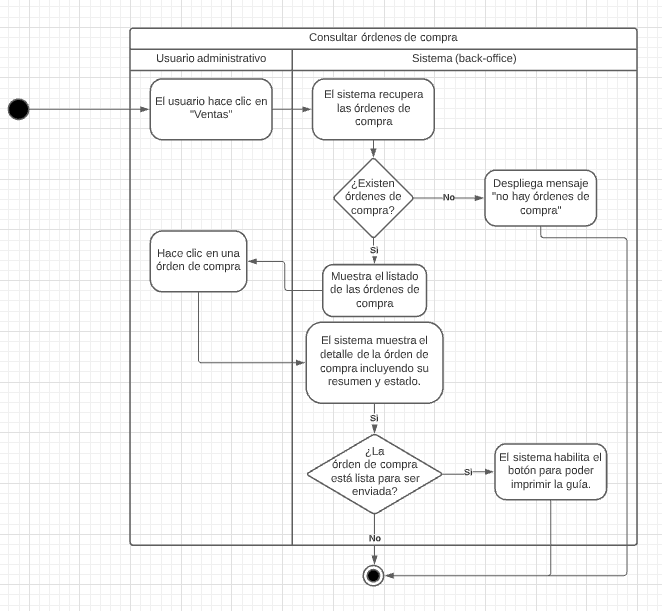
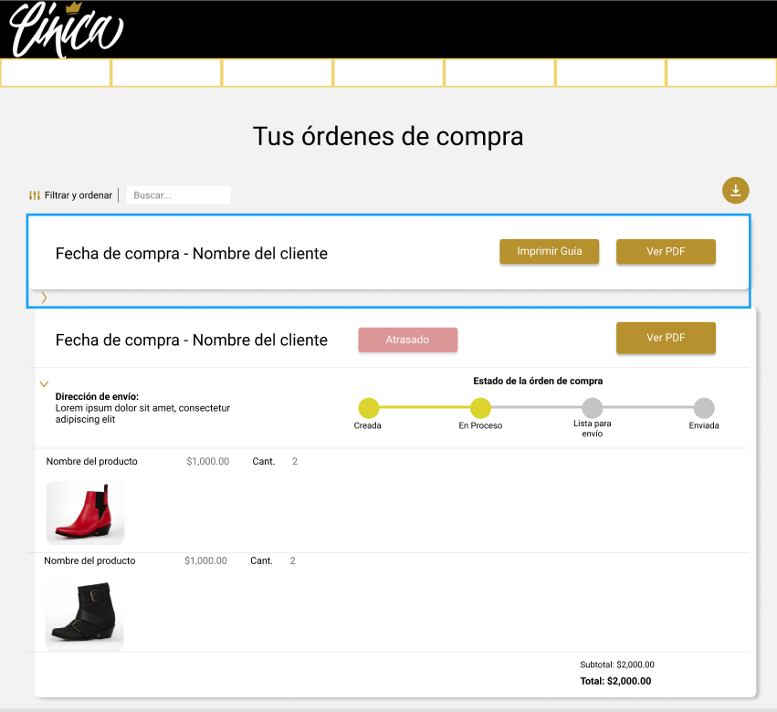

# PP-HA91 - Consultar órdenes de compra

## Requisito

- Yo como administrador quiero consultar las órdenes de compra que tengo para ver su estatus, resumen y poder enviarlos.

## Acceptance criteria

- Dada una lista de órdenes de compra realizadas, cuando el usuario administrador de clic en una en específico, entonces podrá ver su detalle.

- Dada una orden de compra en progreso, cuando se actualize su estado a “Listo para enviar”, entonces el usuario administrador podrá ver el cambio en el detalle y se activará el botón para imprimir la guía y poder mandar el pedido.

## Diagramas

| Diagrama | Artefactos |
| ------------------------|-------------------------- |
| [Diagrama de actividad](https://lucid.app/lucidchart/80b0ae20-abab-4483-b7b3-e84da4d89fcc/edit?viewport_loc=-193%2C-36%2C1646%2C745%2C0_0&invitationId=inv_a0fc9cbc-245e-4379-a6e3-c117b0bec304) |  |
| [Mockup](https://www.figma.com/file/MiuSV67DUVkzMeMKJeAhP0/Backoffice?node-id=0%3A1) |  |

## Architecture Spike

## Artefactos generados

-

## Autores

- Eric Buitrón López

## Auditoría

-

## Versión

- 1.0 - Creación del documento
