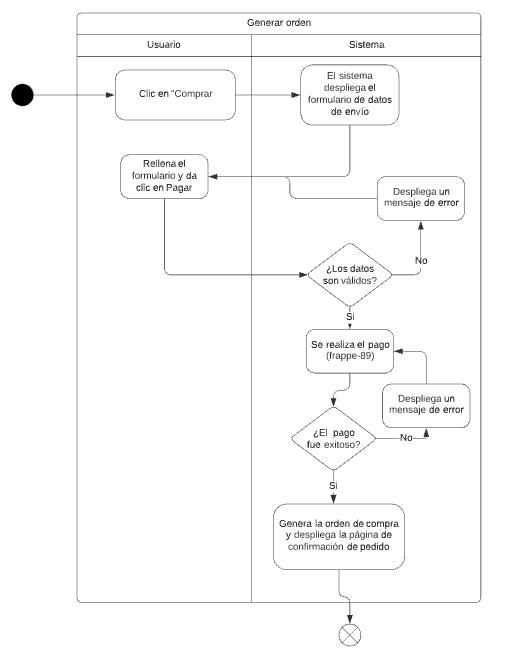

# PP-HA0981 - Generar órdene de compra

## Requisito

- Yo como usuario quiero generar una orden de compra con mis datos de envío para para poder pagar el pedido

## Acceptance criteria

1. Rellenar formulario para generar orden de compra

**Dado** el carrito con los productos que quiero comprar,

**Cuando** el usuario da clic en “Comprar”,

**Entonces** va a ver un formulario que le pide los datos de envío.

2. Generar la orden de compra

**Dado** el pago de un pedido,

**Cuando** sea exitoso,

**Entonces** se genera la orden de compra con toda la información del pedido.
## Diagramas

| Diagrama | Artefactos |
| ------------------------|-------------------------- |
| [Diagrama de actividad](https://lucid.app/lucidchart/35410831-fe06-4746-a71c-5751351b3e8d/edit?invitationId=inv_4aaccdab-d542-49dd-828b-261c9b4a43ae&page=98TTJ~8Bs_WK#) |  |
| [Mockup](https://www.figma.com/file/MiuSV67DUVkzMeMKJeAhP0/Backoffice?node-id=27%3A4) |  |

## Architecture Spike

## Artefactos generados

-

## Autores

- Jan Limpens Gutiérrez
- Eric Buitrón López

## Auditoría

-

## Versión

- 1.0 - Creación del documento
