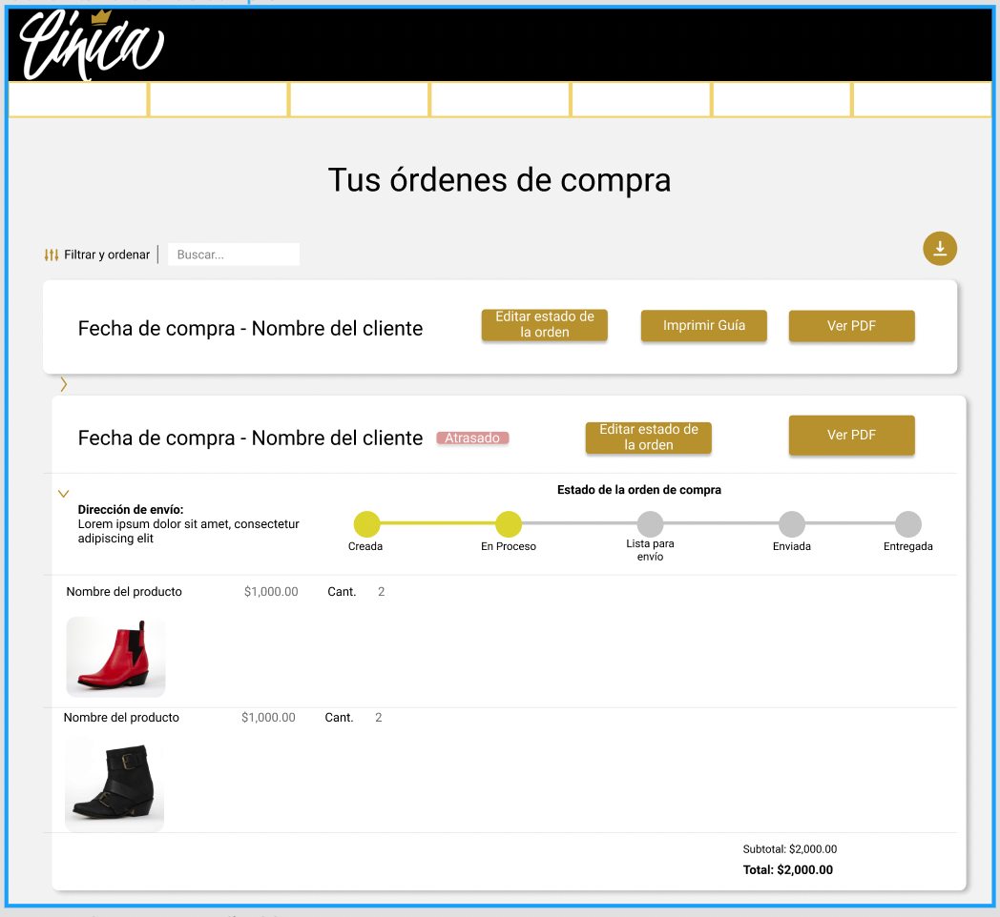

# PP-HA85 Ver PDFs de órdenes de compra

## Requisito

-  Yo como jefe de taller quiero consultar las fichas técnicas de los pedidos pendientes para poder imprimirlos.

## Acceptance criteria

1. Ver PDF de órden de compra.

**Dada** una ficha técnica válida,

**Cuando** el jefe de taller de clic en “Ver PDF”,

**Entonces** el sistema desplegará la ficha técnica correspondiente.

## Diagramas de diseño

| Tipo de diagrama      | Artefactos                                                                                                            |
| --------------------- | --------------------------------------------------------------------------------------------------------------------- |
| Diagrama de actividad |  |
| Wireframes frontend   |  |
| Wireframes PDF   |  |
| Diseño de pruebas     | [PP-85](https://taro-depto-ti.atlassian.net/l/c/AjvdcQHL) |

## Artefactos generados

- <a href="https://github.com/Taro-IT/frappe/pull/64">Pull request</a>

## Autores

- Mauricio Alvarez Milán

## Auditoría

-

## Versión

- 1.0 - Creación del documento
