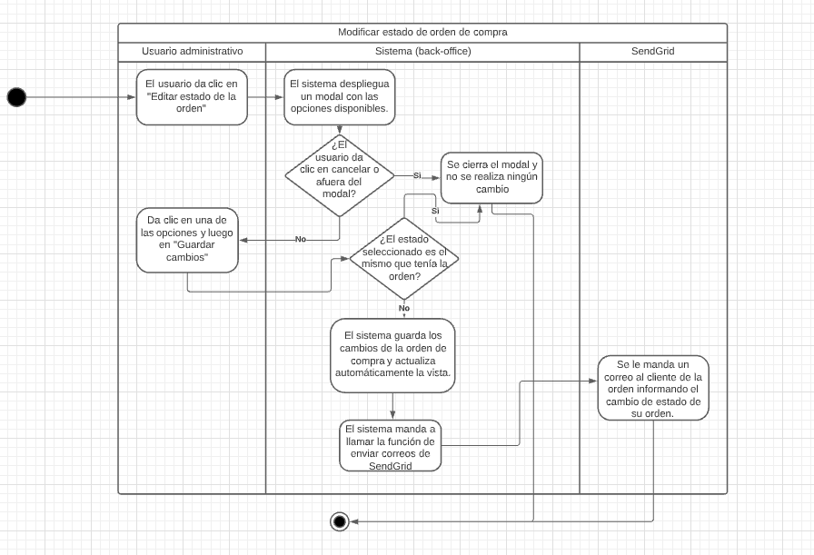
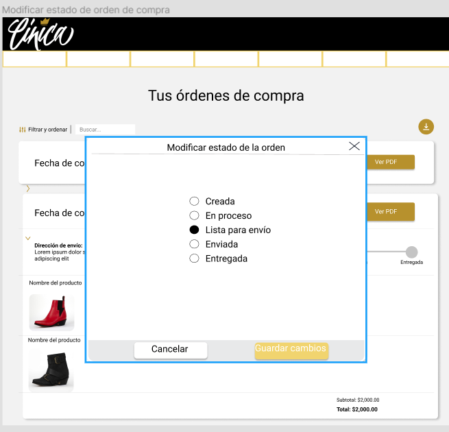
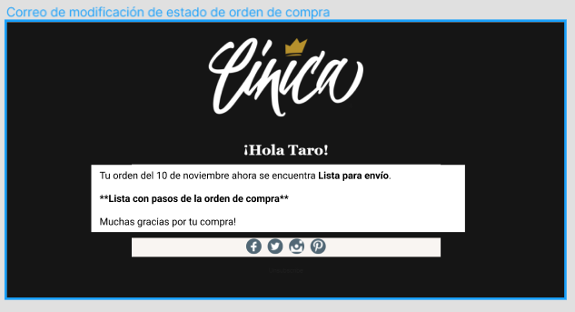

# PP-HA507 Modificar estado de orden de compra

## Requisito

- Yo como administrador quiero modificar el estado de una orden de compra para que mis clientes reciban correos informándoles cómo va su orden.

## Acceptance criteria

1. Editar el estado de la orden de compra.

**Dada** una orden de compra existente,

**Cuando** un usuario con cuenta administrativa de clic en “Editar estado de la orden”,

**Entonces** el usuario con cuenta administrativa podrá seleccionar el nuevo estado de la orden de compra.

2. Actualizar y enviar correo del nuevo estado de la orden de compra.

**Dada** una modificación al estado de una orden de compra,

**Cuando** el usuario administrador de clic en “Guardar cambios”,

**Entonces** la barra de progreso de la orden de compra se actualizará y el cliente recibirá un correo notificándole el cambio en su orden.

## Diagramas de diseño

| Tipo de diagrama      | Artefactos                                                                                                            |
| --------------------- | --------------------------------------------------------------------------------------------------------------------- |
| Diagrama de actividad |  |
| Wireframes frontend   |  |
| Wireframes correos   |  |
| Diseño de pruebas     | [PP-507](https://taro-depto-ti.atlassian.net/l/c/sUd9DK4f) |

## Artefactos generados

- <a href="">Pull request</a>

## Autores

- Eric Buitrón López

## Auditoría

-

## Versión

- 1.0 - Creación del documento
