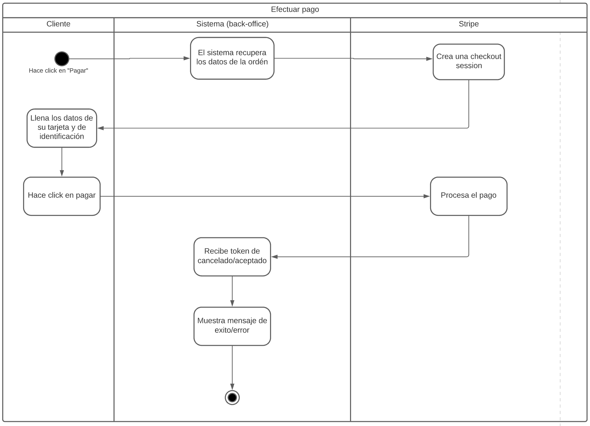

# PP-HA89.2 - Efectuar pagos por Stripe

## Requisito

- Yo como usuario quiero efectuar el pago de mi pedido para que sea enviado a mi dirección.

## Acceptance criteria
1. Pago exitoso
- Dado… que la tarjeta sea aceptada, cuando… cuando un usuario hace click en pagar, entonces… se lanza un mensaje de éxito y se redirige a la Home Page

2. El método de pago es declinado
- Dado… que la tarjeta sea declinada, cuando… cuando un usuario hace click en pagar, entonces… se lanza un mensaje de error adecuado y se pide que ingrese otra tarjeta
## Diagramas

| Diagrama | Artefactos |
| ------------------------|-------------------------- |
| [Diagrama de actividad](https://lucid.app/lucidchart/0d9b62db-8478-48a3-86cc-f4ae721b6395/edit?invitationId=inv_251a4378-eb5a-416f-b908-995da2b40ff5&page=0_0#) |  |

## Autores

- Mauricio Alvarez Milán
- Jorge Sánchez

## Auditoría

-

## Versión

- 1.0 - Creación del documento
