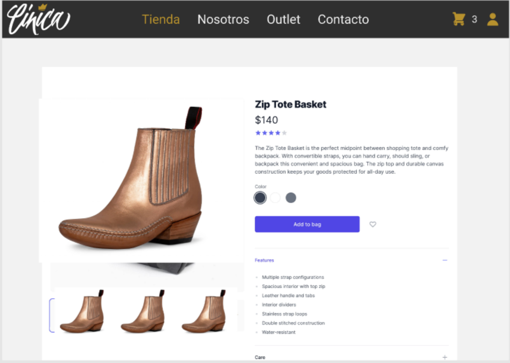

# PP-HA69 Cambiar colores del producto

## Requisito

- Yo como usuario quiero cambiar los colores de mi producto para que quede como yo quiero

## Acceptance criteria

1. Cambiar el material de una parte customizable

- **Dado** un producto personalizable en la tienda,
**Cuando** se le da clic en el signo de + en la parte personalizable,
**Entonces**  aparecerá un dropdown con las opciones de personalización.

- **Dada** la lista de opciones personalizables,
**Cuando** se seleccione alguna de ellas,
**Entonces**  se mostrará la imagen de ese material.

## Diagramas de diseño

| Tipo de diagrama      | Artefactos                                                                                                            |
| --------------------- | --------------------------------------------------------------------------------------------------------------------- |
| Wireframes frontend   |  |
| Diseño de pruebas     | [PP-62](https://taro-depto-ti.atlassian.net/wiki/spaces/FC/pages/21299244/FRAPPE+-+69+Yo+como+usuario+quiero+cambiar+los+colores+de+mi+producto+para+que+quede+como+yo+quiero) |

## Artefactos generados

- <a href="">Pull request</a>

## Autores

- Iván Díaz
- Jan Limpens

## Auditoría

-

## Versión

- 1.0 - Creación del documento
