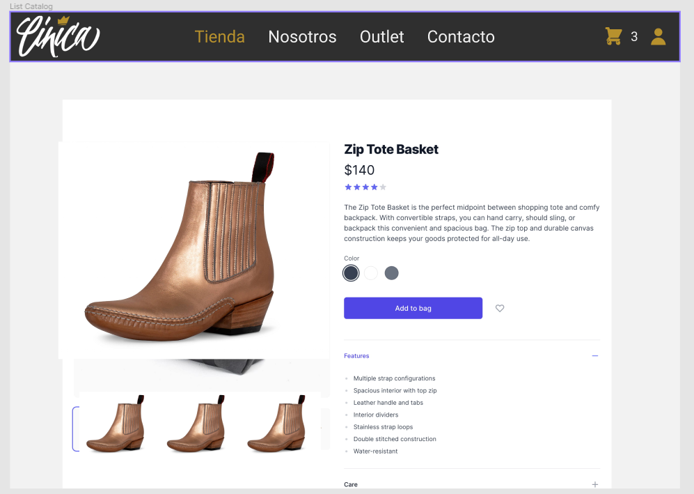

# PP-HA507 Modificar estado de orden de compra

## Requisito

- Yo como usuario quiero ver el detalle de un producto para ver la información adicional de una posible compra

## Acceptance criteria

1. Editar el estado de la orden de compra.

**Dado** un producto listado en la tienda,

**Cuando** se le da clic al producto,

**Entonces**  te lleva a la página donde sale su detalle.

## Diagramas de diseño

| Tipo de diagrama      | Artefactos                                                                                                            |
| --------------------- | --------------------------------------------------------------------------------------------------------------------- |
| Wireframes frontend   |  |
| Diseño de pruebas     | [PP-62](https://taro-depto-ti.atlassian.net/wiki/spaces/FC/pages/21430273/FRAPPE+-+62+Yo+como+usuario+quiero+ver+el+detalle+de+un+producto+para+ver+la+informaci+n+adicional+de+una+posible+compra) |

## Artefactos generados

- <a href="">Pull request</a>

## Autores

- Iván Díaz
- Jan Limpens

## Auditoría

-

## Versión

- 1.0 - Creación del documento
