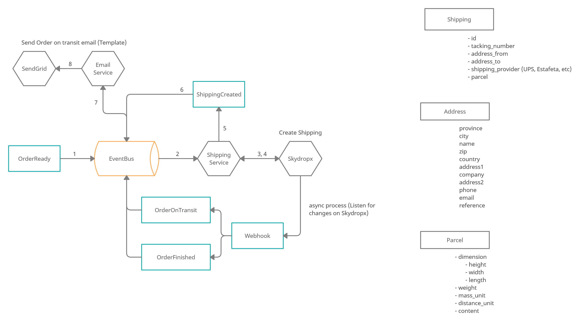

# PP-98 - Sign In

## Requisito

- El sistema crea una orden de shipping para poder realizar envíos.

## Acceptance criteria

- Dada una orden de compra cuando esta construida (terminada) entonces crear una orden de Shipping y mostrar la información de la misma.

- Dada una orden de compra cuando esta construida (terminada) entonces enviar un mensaje de orden en proceso de envío al cliente.

## Diagramas de diseño

<table>
  <theader >
    <th >Diagrama de flujo</th>
      <th style={{textAlign:"center"}}>Artefactos de diseño</th>
  </theader>

  <tbody align="center">
    <tr >
      <td >Diagrama de flujo</td>
      <td>
        <ul>
          
        </ul>
      </td>
    </tr>
    <tr>
      <td>Casos de prueba</td>
      <td>
        <ul>
          <a href="https://taro-depto-ti.atlassian.net/wiki/spaces/FC/pages/7700521/FRAPPE-98+Crear+orden+de+shipping+sandbox#Pruebas-Unitarias">Architecture spike con pruebas unitarias y pruebas de integración.</a>
        </ul>
      </td>
    </tr>
  </tbody>
</table>

## Artefactos generados

- <a href="https://github.com/Taro-IT/frappe/pull/32">Pull request</a>

## Autores

- Alonso Vladimir Salvador Camacho
- Raúl Rosario Galaviz

## Auditoría
-
  

## Versión

- 1.0