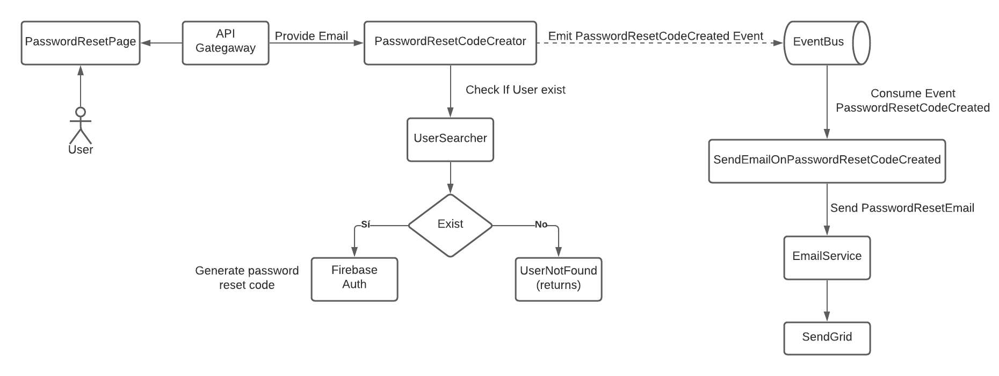

# PP-HA-503 - Generar password reset link

## Requisito

- Yo como usuario quiero recuperar mi contraseña para no perder mi acceso si la pierdo.

## Acceptance criteria

**Dado** un usuario que olvido su contraseña

**Cuando** haga click en olvidé mi contraseña y de su email

**Entonces** enviar un correo con el link para restablecer su contraseña

## Diagramas

| Diagrama | Artefactos |
| ------------------------|-------------------------- |
| [Diagrama de actividad](https://lucid.app/lucidchart/30a161df-80a2-490f-b089-ee3f9390a5fd/edit?viewport_loc=-101%2C-164%2C2048%2C1128%2C0_0&invitationId=inv_0d142b44-b766-46fd-9fc8-bb8791fd0641) |  |
| Diseño de pruebas | [PP-TS-503](https://taro-depto-ti.atlassian.net/l/c/Tncb000X) |

## Artefactos generados

- [Pull Request - Backend](https://github.com/Taro-IT/frappe/pull/59)

## Autores

- Alonso Vladimir Salvador Camacho

## Auditoría

-

## Versión

### 1.0
- Creación del documento
