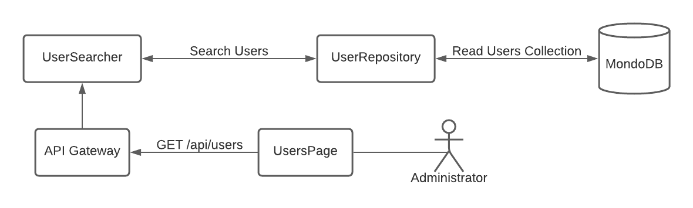

# PP-HA505 - Buscar usuarios

## Requisito

- "Yo como administrador quiero ver un listado de todas las cuentas del sistema para poder tomar desiciones"

## Acceptance criteria

**Dado** un administrador

**Cuando** haga click en Usuarios

**Entonces** navegar a la página de administración de usuarios.

## Diagramas

| Diagrama | Artefactos |
| ---------------------|------------------------ |
| [Architecture Chart](https://lucid.app/lucidchart/0c799ac7-9d2b-4c3b-b6d7-620f48883320/edit?viewport_loc=-235%2C-95%2C2048%2C1128%2C0_0&invitationId=inv_8307d7b6-1ffb-496c-8aff-62287abcf335) |  |

## Artefactos generados

- [Pull Request - Backend](https://github.com/Taro-IT/frappe/pull/54)

## Autores

- Alonso Vladimir Salvador Camacho

## Auditoría
-

## Versión

- 1.0 - Creación del documento
