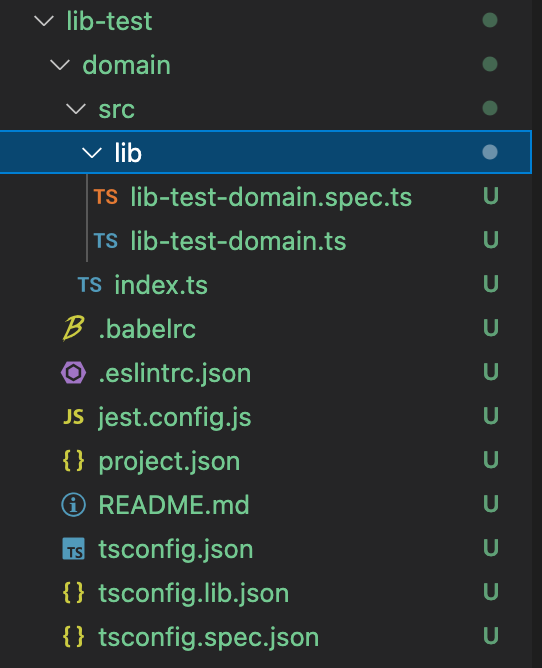
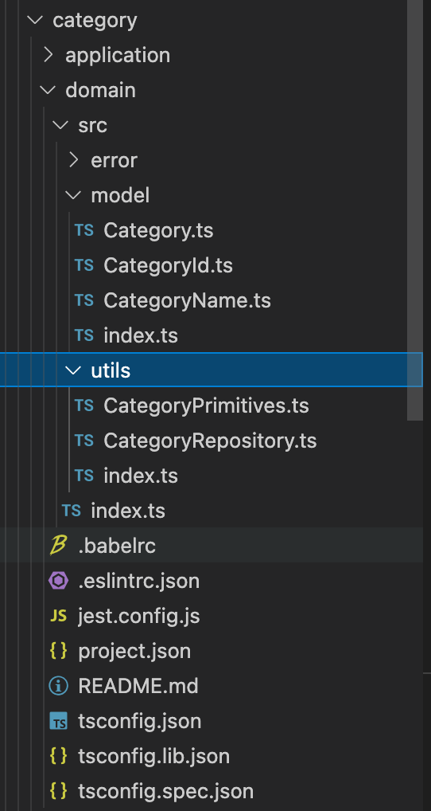
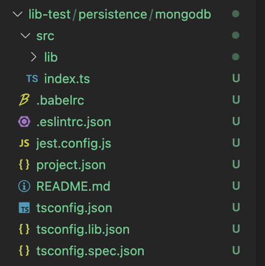
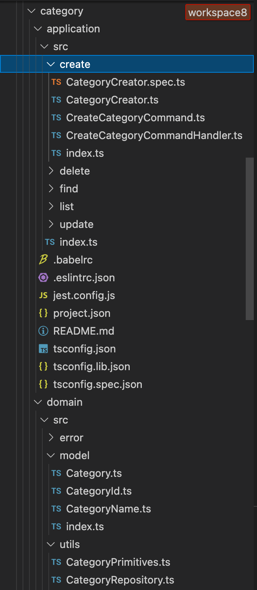
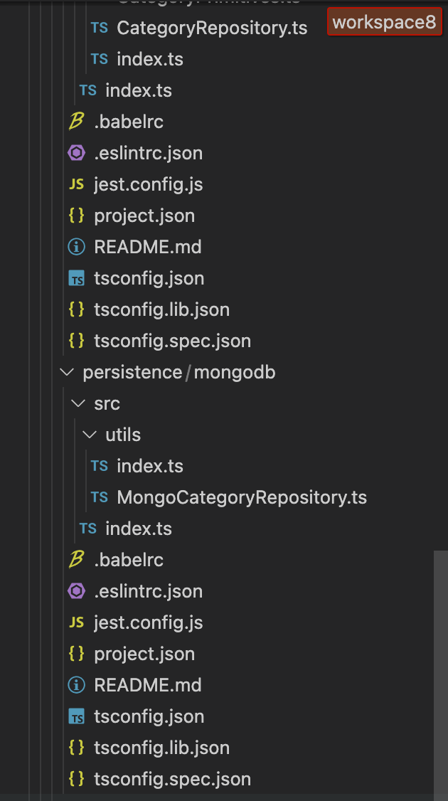

# PP-G02 - Guía para hacer las librerías de Backend

## Objetivo(s)

- Orientar en la manera en la que se programa un caso de uso de creación en el backend

## Pre-requisitos

- Tener instalado el repositorio y poder correrlo
- Haber leido [la estructura de archivos](../architecture/file-structure)

## Pasos a seguir
### 1 - Capa Domain
1.  Para crear una librería de dominio debes correr el comando 
 `nx g @nrwl/node:lib <lib-name/domain>`

    El comando anterior creará  la siguiente estructura de archivos
  

2. Debes borrar la carpeta `lib`y el contenido del archivo index.ts. 
3. Crea la carpeta `model`, donde definirás los campos de tu entidad de la base de datos.
4. Crea 1 archivo con el nombre de tu caso de uso, para este ejemplo usaremos **Category.ts**, el cuál contendrá 2 métodos:
  - fromPrimitives:
    Este método recibe categoryPrimitives, y devuelve una nueva categoría
    ```
    static fromPrimitives(primitives: CategoryPrimitives): Category {
      return new Category(new CategoryId(primitives.id), new CategoryName(primitives.name));
    }

    ```
  - toPrimitives:
    Devuelve los datos primitivos de un caso de uso.
    ```
    toPrimitives(): CategoryPrimitives {
      return {
        id: this.id.value,
        name: this.name.value
      };
    }
    ```

      :::note

      Recuerda que primitives hace referencia a los tipos de dato primitivos, es decir, strings, numbers, etc. Y los Value Objects son una representación específica de un primitivo.

      :::

  5. Crea 1 archivo para cada campo de tu entidad, con el nombre `<CasoDeUso><NombreDelCampo>.ts`, por ejemplo, CategoryId.ts
     Cada uno de estos archivos debe ser una clase que extiende del value object de su primitive, por ejemplo:

     ```
      // CategoryId.ts
      import { Uuid } from '@frappe/common/value-object';

      export class CategoryId extends Uuid {}

     ```

  6. Crea un archivo `index.ts` al nivel de la carpeta **model**, el cual debe exportar cada srchivo que hayas creado. Por ejemplo:
  ```
    export { Category } from './Category';
    export { CategoryId } from './CategoryId';
    export { CategoryName } from './CategoryName';
  ```

  7. Crea una carpeta **utils** al nivel de src, la cual contendrá 3 archivos

  - CasoDeUsoPrimitives.ts

    En nuestro caso se llamará `CategoryPrimitives.ts`, y debe definir una interfaz que tenga todos los primitivos que confirman a tu entidad. Por ejemplo:

      ```
        export interface CategoryPrimitives {
          readonly id: string;
          readonly name: string;
        }
      ```

  - CasoDeUsoRepository.ts

      En este caso se llamará `CategoryRepository.ts`. Este archivo define una interfaz con los headers para los métodos que se implementarán en el repositorio de mongo, en el paso siguiente. Un ejemplo puede ser:
      ```
        import { Category, CategoryId, CategoryName } from '../model';
        import { Nullable } from '@frappe/common/utils';

        export interface CategoryRepository {
          save(category: Category): Promise<void>;
          findByName(name: CategoryName): Promise<Nullable<Category>>;
        }

      ```

  - index.ts
  
    Aquí debes exportar los archivos que creaste dentro de la carpeta. Debe verse como:
      ```
        export type { CategoryPrimitives } from './CategoryPrimitives';
        export type { CategoryRepository } from './CategoryRepository';

      ```

  :::note

      En esta capa también crearás los Custom Errors que puedas necesitar cuando crees tus métodos en la capa de aplicación

  :::

  8. En el index.ts al nivel de domain, exporta todas las carpetas que creaste.
  ```
  export * from './model';
  export * from './utils';
  ```

  9. Verifica que la estructura de estas carpetas se vea así
  

------------------------
### 2 - Capa Persistence
1.  Para crear una librería de persistence debes correr el comando 
 `nx g @nrwl/node:lib <lib-name/persistence/mongodb>`

  Cambia la palabra mongodb si estás conectandote a otro servicio externo. En esta guía nos conectaremos a mongodb.

  El comando anterior creará  la siguiente estructura de archivos
  

2. Debes borrar la carpeta `lib`y el contenido del archivo index.ts. 
3. Después crea una carpeta que se llame `utils` y crea un archivo que se llame `Mongo<NombreLib>Repository.ts`, además de un archivo llamado `index.ts`. La estructura debe quedar como se muestra en la imágen:
4. En el archivo `Mongo<NombreLib>Repository.ts` debe ir toda la lógica que conecta al servicio externo, en este caso, a Mongo. Puedes basarte en un archivo de algún otro caso de uso para crear el tuyo

    Para esta guía crearemos una categoría, así que el archivo de repository debería tener al menos 2 métodos:
``` 
import { MongoRepository } from '@frappe/common/persistence/mongodb'; // Importas el Repositorio de Mongo
import { Category, CategoryId, CategoryName, CategoryPrimitives, CategoryRepository } from '@frappe/category/domain'; // Importas los tipos que creaste en la capa de dominio

export class MongoCategoryRepository extends MongoRepository implements CategoryRepository {

  // Obtienes el nombre del módulo de Mongo
  protected moduleName(): string {
    return 'categories';
  }

  // Este método guarda la categoría que recibe en la base de datos
  // Toma en cuenta que recibe una categoría de tipo Category, es decir, de su propio tipo
  async save(category: Category): Promise<void> {
    return this.persist(category.id.value, category);
  }


  // Éste método encuentra una categoría, dado su nombre, el cuál recibe como tipo ValueObject, como lo definiste en la capa de dominio
  async findByName(name: CategoryName): Promise<Nullable<Category>> {
    const collection = await this.collection();
    const document = await collection.findOne({ name: name.value });


    if (document === null) {
      return null;
    }

    return Category.fromPrimitives({ ...document, id: document._id } as CategoryPrimitives);
  }
```

4. En el archivo `index.ts` a nivel de la carpeta `utils`, exporta el archivo que acabas de crear.
```
export { MongoCategoryRepository } from './MongoCategoryRepository';
```

5. En el archivo `index.ts` a nivel de la carpeta `src`, exporta la carpeta utils.


--------------------------------------------------
### 3 - Capa Application
1.  Para crear una librería de aplicación debes correr el comando 
 `nx g @nrwl/node:lib <lib-name/application>`

  El comando anterior creará la misma estructura de archivos como en las capas anteriores

2. Debes borrar la carpeta `lib`y el contenido del archivo index.ts. 

3. A nivel de `src` crearás las carpetas para cada acción de tu caso de uso. Algunos nombres de dichas acciones son **create, delete, find, list, etc.**

    Para el ejemplo de esta guía debes crear una carpeta que se llame `create`, la cuál contendrá 3 archivos principales, `CategoryCreator.ts`, `CreateCategoryCommand.ts` y `CreateCategoryCommandHandler.ts`. 
**Recuerda sustituir la palabra _Category_ por la correspondiente a tu caso de uso.**

4. Para llenar el archivo `CreateCategoryCommand.ts` deberás crear el payload necesario para crear una categoría en forma de una interfz. Además de un constructor para tu comando. Por ejemplo:
```
import { Command } from '@tshio/command-bus';

// Los campos necesarios para crear una categoría
interface CreateCategoryCommandPayload {
  readonly id: string;
  readonly name: string;
}

/El constructor del comando
export class CreateCategoryCommand implements Command<CreateCategoryCommandPayload> {
  //Esta linea crea una variable type que guarda el nombre del comando.
  readonly type = CreateCategoryCommand.name;

  constructor(readonly payload: CreateCategoryCommandPayload) {}
}

```
5. El archivo `CategoryCreator.ts` es quien hace toda la mágia ya que es el encargado que hacer llegar la información a nuestro repositorio que escribirmos en la capa de persitence. Aquí vas a poner una parte la lógica de verificación de datos y podrás llamar los métodos del repositorio.  Por ejemplo:
```
import { Category, CategoryAlreadyExists, CategoryId, CategoryName, CategoryRepository } from '@frappe/category/domain';
import { CategoryNameFinder } from '../find'; // En esta guía suponemos que ya se implementó este caso

// Los atributos (props) del Creator deben ser el repositorio y cualquier otro caso de uso que necesites. Normalmente son finders.
interface Props {
  readonly categoryRepository: CategoryRepository;
  readonly categoryNameFinder: CategoryNameFinder;
}

export class CategoryCreator {
  // Atributos de la clase Creator
  private readonly categoryNameFinder: CategoryNameFinder;
  private readonly categoryRepository: CategoryRepository;

  // El constructor inicializa los atributos
  constructor({ categoryRepository, categoryNameFinder }: Props) {
    this.categoryRepository = categoryRepository;
    this.categoryNameFinder = categoryNameFinder;
  }

  // Este es el único método publico que tendrá esta clase, y es el que ejecuta la acción de crear un registro dados los campos de una categoría (atributos de la función)
  async execute(id: string, name: string) {

    // Primero verificamos que no exista una categoría con el mismo nombre
    const exists = await this.categoryExists(name);

    if (exists === null) {
      // Si la categoría ya existe, entonces arroja un error custom, esto lo veremos en otra guía.
      throw new CategoryAlreadyExists(name);
    }

    // Si no existe la categoría creamos una, con sus tipos, CategoryName y CategoryId
    const category = new Category(new CategoryId(id), new CategoryName(name));

    // Esta línea llama al comando save del repositorio y y guarda la categoría
    return this.categoryRepository.save(category);
  }

  // Esta función es la que llama a la función execute del caso de uso CategoryNameFinder
  private async categoryExists(name: string) {
    try {
      await this.categoryNameFinder.execute(name);
      return null;
    } catch (error) {
      return error;
    }
  }
}

```
Los creators son muy similares en la forma, sin embargo la implementación de execute puede variar.

6. El archivo `CreateCategoryCommandHandler.ts` es el encargado de manejar la lógica de los comandos, es decir, cuando se llama un comando, el handler es el encargado de que se ejecute.  Un command handler puede verse así:
```
import { CommandHandler } from '@tshio/command-bus';

// Debes importar el command y el creator
import { CreateCategoryCommand } from './CreateCategoryCommand';
import { CategoryCreator } from './CategoryCreator';

// Los atributos de un command handler son el creator
type CategoryProps = {
  readonly categoryCreator: CategoryCreator;
};

export class CreateCategoryCommandHandler implements CommandHandler<CreateCategoryCommand> {
  private readonly categoryCreator: CategoryCreator;

  // Obtienes el nombre del comando 
  readonly commandType = CreateCategoryCommand.name;

  // Inicializas el creator
  constructor({ categoryCreator }: CategoryProps) {
    this.categoryCreator = categoryCreator;
  }

  // El método execute llama al método execute del creator, con el payload que definiste en en command
  async execute(command: CreateCategoryCommand) {
    const { id, name } = command.payload;

    // Llamas al método execute del creator
    return this.categoryCreator.execute(id, name);
  }
}

```

7. Vuelve al `index.ts` del nivel src y exporta los casos que creaste. Por ejemplo:
```
export * from './create';
export * from './find';
```
8. Asegúrate que la estructura de archivos se vea algo así.




## Salidas

- Las librerías de backend listas

## Autores
- Karla Daniela Romero Pérez

## Auditoría
- Vladimir Salvador
- Mauricio Álvarez
- Raúl Rosario Gálaviz 


## Versión 1.0

Se crea la guía
