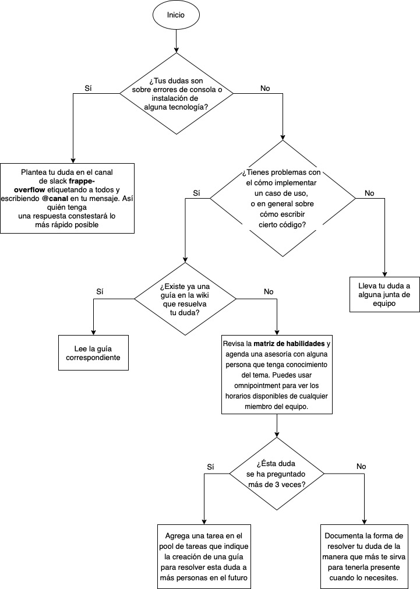

# G03 - Guía para adquirir conocimiento técnico

## Objetivo(s)

Orientar a las personas sobre qué hacer cuando surge una duda sobre las tecnologías o implementación de código.

## Pre-requisitos

Ninguno

## Pasos a seguir
Usa el siguiente diagrama para identificar lo que debes hacer para adquirir conocimiento técnico.

## Salidas

Dudas resueltas y personas con mayor conocimiento técnico

## Autores

- Karla Romero

## Auditoría

- 

## Versión 1.0
Se creó la guía
